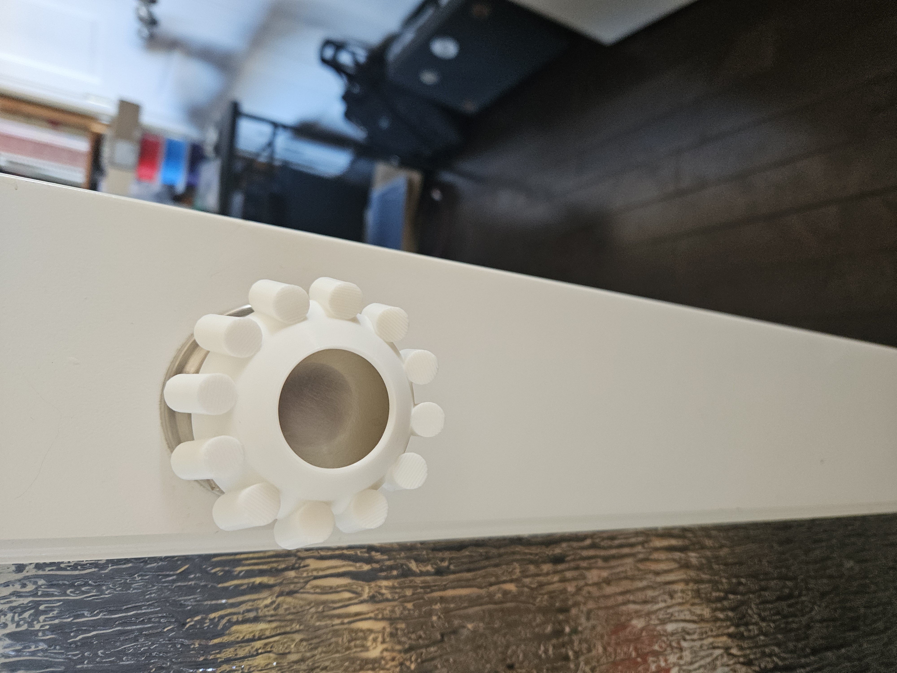

<!--- Open Source Assistive Technology: GitHub Readme Template Version 1.2 (2024-May-27)  --->

<!--- INSTRUCTIONS --->
<!--- This is a markdown template for creating the README.md file in a GitHub repository. This file is rendered and displayed automatically when someone visits the repository.

This document includes helper text that will not be displayed when rendered. Any text between the less-than sign + exclamation mark + three hyphen-minus (<!---) and matching three hyphen-minus + greater-than sign will not be displayed. This helper text can be deleted once the corresponding section is completed.

This template has a number of fields that can be searched and replaced with other text:
 - arthritis_door_knob Replace this with filename-friendly version of the device with underscores. e.g., Open_Wobble_Switch
 - <DeviceName> Replace this with the human-readable name of the device with spaces. e.g., Open Wobble Switch
 - Nicolas Vaagen Replace this with the person or organization responsible for the design. e.g., John Doe.
 - https: Replace this with the web address for the repository. e.g., (e.g., https://github.com/makersmakingchange/Open-Wobble-Switch))
 - <MMCWebLink> This is the website address including an alphanumeric id for the Makers Making Change Website. e.g., 01tJR000000698oYAA. This will come from MMC staff.
 - <MaterialCost> Replace this with the dollar cost and currency (CAD, USD, etc.) of the materials of the device.
 - <ShippingCost> Replace this with the dollar cost and currency (CAD, USD, etc.) of shipping the device (if possible).
 - 2025 year(s) of the copyright

Any text that is currently holding a space / is an instruction for the person filling in the README is in all capitals, to make it easier to see them in a rendered version.

--->

<!--- TITLE --->
# arthritis door knob
<!--- Should match the name of the GitHub repository. Choose something descriptive rather than whimsical.  --->

## Overview
<!--- A brief summary of the project. What it does, who it is for, how much it costs. --->
The arthritis door knob makes door knobs easier to open for thouse who have dificulty grasping. It attaches to an existing round door knob.

The device is comprised of off-the-shelf adhesive strips and 3D printed parts.

The arthritis door knob is open assistive technology (OpenAT). Under the terms of the open source licenses, the device may be built, used, and improved upon by anyone.

The overall cost of materials is about $20 (plus $10 for component shipping).

The cost comes from buying the double sided adhesive.

## Makers Making Change Assistive Device Library
<MMCWebLink>

## How to Obtain the Device
### 1. Do-it-Yourself (DIY) or Do-it-Together (DIT)

This is an open-source assistive technology, so anyone is free to build it. All of the files and instructions required to build the device are contained within this repository. Refer to the Maker Guide below.

### 2. Request a build of this device

You may also submit a build request through the [Makers Making Change Assistive Device Library Listing](<MMCWebLink>) to have a volunteer maker build the device. As the requestor, you are responsible for reimbursing the maker for the cost of materials and any shipping.

### 3. Build this device for someone else

If you have the skills and equipment to build this device, and would like to donate your time to create the device for someone who needs it, visit the [MMC Maker Wanted](https://makersmakingchange.com/maker-wanted/) section.

## Build Instructions
<!--- Outline the major steps required to create a build --->
The device itself is just a PLA print. Print the outer door knob extension.
Then attach the device to your doorknob. Alien tape works well: [Alien Tape](https://www.alientape.ca/)

### 1. Read through the Maker Guide

The [Maker Guide](https://github.com/nicvagn/arthritis-door-knob/blob/main/Documentation/arthritis_door_knob_Summary.md)  contains all the necessary information to build this device, including tool lists, assembly instructions, programming instructions (if applicable) and testing.

### 2. Order the Off-The-Shelf Components

The [Bill of Materials](/Documentation/arthritis_door_knob_BOM.csv) lists all of the parts and components required to build the device.

### 3. Print the 3D Printable components

All of the files and individual print files can be found in the [/Build_Files/3D_Printing_Files](/Build_Files/3D_Printing_Files/) folder.

### 4. Assemble the arthritis door knob

NA: the device does not merit them

## How to improve this Device
As open source assistive technology, you are welcomed and encouraged to improve upon the design.

## Files
### Documentation
<!--- Update the name, link, and version for documentation --->
| Document             | Version | Link |
|----------------------|---------|------|
| Design Rationale     | 1.0     | [arthritis_door_knob_Design_Rationale](/Documentation/arthritis_door_knob_Summary.md)     |
| Maker Guide          | 1.0     | [arthritis_door_knob_Maker_Guide](/Documentation/arthritis_door_knob_Summary.md)     |
| Bill of Materials    | 1.0     | [arthritis_door_knob_Bill_of_Materials](/Documentation/arthritis_door_knob_BOM.csv)     |
| Changelog            | 1.0     | [Changelog](CHANGES.txt)     |

### Design Files
<!--- Include a copy of the original design files to facilitate easy editing and customization. Consider also including a generic format (e.g., STEP) --->
 - [CAD Files](/Design_Files/CAD_Design_Files)
 - [SCAD Files](Design_Files/SCAD_FILES/)

### Build Files
<!--- Include a copy of the build files intended for manufacturing. This may include svg files for laser cutting, stl files for 3d printing, Gerber files for custom PCBs, and Arduino files for custom firmware. --->
 - [3D Printing Files](/Build_Files/3D_Printing_Files)

## License
<!--- Add the year(s) for the copyright and the Designer Name. You may use the standard set of open licenses or choose your own for the hardware, software, and accompanying materials. --->
Copyright (c) 2025 Nicolas Vaagen.

This repository describes Open Hardware:
 - Everything needed or used to design, make, test, or prepare the arthritis door knob is licensed under the [CERN 2.0 Weakly Reciprocal license (CERN-OHL-W v2) or later](https://cern.ch/cern-ohl ) .
 - All software is under the [GNU General Public License v3.0 (GPL-3.0)](https://www.gnu.org/licenses/gpl.html).
 - Accompanying material such as instruction manuals, videos, and other copyrightable works that are useful but not necessary to design, make, test, or prepare the <Device-Name> are published under a [Creative Commons Attribution-ShareAlike 4.0 license (CC BY-SA 4.0)](https://creativecommons.org/licenses/by-sa/4.0/) .

You may redistribute and modify this documentation and make products using it under the terms of the [CERN-OHL-W v2](https://cern.ch/cern-ohl).
This documentation is distributed WITHOUT ANY EXPRESS OR IMPLIED WARRANTY, INCLUDING OF MERCHANTABILITY, SATISFACTORY QUALITY AND FITNESS FOR A PARTICULAR PURPOSE.
Please see the CERN-OHL-W v2 for applicable conditions.

Source Location: https://github.com/nicvagn/arthritis-door-knob

## Attribution
<!--- Provide any necessary attribution for designs or components that are included in the device or as part of the project. --->
The device was designed by Nicolas Vaagen.

<!--- This is the attribution for the template. --->
The documentation template was created by Makers Making Change / Neil Squire Society and is used under a CC BY-SA 4.0 license. It is available at the following link: [https://github.com/makersmakingchange/OpenAT-Template](https://github.com/makersmakingchange/OpenAT-Template)

### Contributors
<!--- List the names of the people that contributed to the design. This could include the original source of the idea, designers, testers, documenters, etc. --->
Designers:
NA
Testers:
Mavis Werschner

---
<!--- This is standard boilerplate for Makers Making Change. No changes should be required. --->
<!-- ABOUT MMC START -->
## About Makers Making Change

Makers Making Change is a program of [Neil Squire](https://www.neilsquire.ca/), a Canadian non-profit that uses technology, knowledge, and passion to empower people with disabilities.

Makers Making Change leverages the capacity of community based Makers, Disability Professionals and Volunteers to develop and deliver affordable Open Source Assistive Technologies.

 - Website: [www.MakersMakingChange.com](https://www.makersmakingchange.com/)
 - GitHub: [makersmakingchange](https://github.com/makersmakingchange)
 - Bluesky: [@makersmakingchange.bsky.social](https://bsky.app/profile/makersmakingchange.bsky.social)
 - Instagram: [@makersmakingchange](https://www.instagram.com/makersmakingchange)
 - Facebook: [makersmakechange](https://www.facebook.com/makersmakechange)
 - LinkedIn: [Neil Squire Society](https://www.linkedin.com/company/neil-squire-society/)
 - Thingiverse: [makersmakingchange](https://www.thingiverse.com/makersmakingchange/about)
 - Printables: [MakersMakingChange](https://www.printables.com/@MakersMakingChange)

### Contact Us
For technical questions, to get involved, or to share your experience we encourage you to [visit our website](https://www.makersmakingchange.com/) or [contact us](https://www.makersmakingchange.com/s/contact).
<!-- ABOUT MMC END -->
